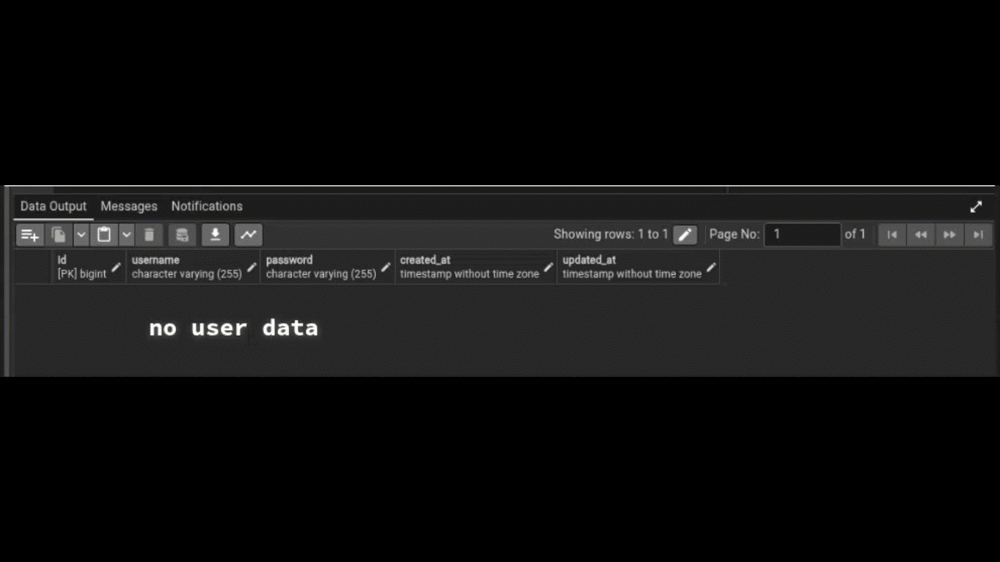

<p align="center"><a href="https://laravel.com" target="_blank"></a></p>

<p align="center">


</p>

# Laravel Framework Personal

A Laravel learning repository for OOP school tasks, focusing on database connections and authentication with PostgreSQL.

## Repository Structure

This project uses a branch-per-task workflow.

### Branch Organization

| Branch | Purpose |
|--------|---------|
| [`main`](https://github.com/ractopen/LaravelFrameWorkPersonal/tree/main) | Base Laravel template for copying |
| [`task2-routing`](https://github.com/ractopen/LaravelFrameWorkPersonal/tree/task2-routing) | Task 2: Routing in Laravel |
| [`task3-connectToPGSQL`](https://github.com/ractopen/LaravelFrameWorkPersonal/tree/task3-connectToPGSQL) | Task 3: Connect to PostgreSQL |
| [`task4-models-eloquent`](https://github.com/ractopen/LaravelFrameWorkPersonal/tree/task4-models-eloquent) | Task 4: Models and Eloquent |

### Workflow

```bash
# Create a new branch for each task
git checkout -b task-name

# Work on the task
# ...

# Commit and push
git add .
git commit -m "Complete task: description"
git push -u origin task-name
```

### Quick Setup

```bash
# Navigate to project directory
cd LaravelFrameWorkPersonal

# Checkout to task3 branch
git checkout task3-connectToPGSQL

# Install dependencies
composer install

# Setup environment
cp .env.example .env || or remeove .example at the end of file .env.example to .env
php artisan key:generate

# Setup PostgreSQL database (make sure PostgreSQL is running) edit .env first for user and password
php artisan migrate

# Start server
php artisan serve
```

## What I Did

### Branch: `task-connectToPGSQL` - Simple Login/Register and Session with PostgreSQL



### Overview
Basic authentication system with **username and password**, connected to PostgreSQL via pgAdmin.

**Sessions stored in database**

#### 🔹 Register Button Flow
```
User fills form → Clicks "Register" →
1. POST /register
2. Check if username exists in PostgreSQL
3. If exists → Error: "User already exists"
4. If new → Save plain text password to database
5. Redirect to /login

SESSION CREATION:
├─ Generate random session ID (e.g., "abc123xyz...")
├─ Store in sessions table: user_id, username, IP, browser info
├─ Send session ID to browser as cookie
└─ User stays logged in on all pages
```

#### 🔹 Login Button Flow
```
User fills form → Clicks "Login" →
1. POST /login
2. Search PostgreSQL for username
3. If not found → Show error "Invalid credentials"
4. If found → Compare plain text password
5. If wrong → Show error "Invalid credentials"
6. If correct → Create session in database → Redirect to / (welcome)

SESSION CREATION:
├─ Generate random session ID (e.g., "abc123xyz...")
├─ Store in sessions table: user_id, username, IP, browser info
├─ Send session ID to browser as cookie
└─ User stays logged in on all pages
```

#### 🔹 Logout Button Flow
```
User clicks "Logout" →
1. POST /logout
2. Delete session from database (removes row from sessions table)
3. Clear browser cookie
4. Redirect to /login
```

### How Database Sessions Work

**Visual Flow:**
```
LOGIN:
Browser → Sends email/password → Laravel
Laravel → Checks PostgreSQL users table → Valid!
Laravel → Creates session row in sessions table
Laravel → Sends session ID cookie → Browser
Browser → Stores cookie

NEXT PAGE VISIT:
Browser → Sends cookie with session ID → Laravel
Laravel → Looks up session ID in sessions table
Laravel → Finds user_id → User is logged in!
Laravel → Shows protected content

LOGOUT:
Browser → Clicks logout → Laravel
Laravel → Deletes row from sessions table
Laravel → Clears cookie → Browser
Browser → No longer logged in
```

**What's in the sessions table:**
```
id          | user_id | ip_address  | user_agent           | payload        | last_activity
------------|---------|-------------|----------------------|----------------|---------------
abc123xyz   | 1       | 127.0.0.1   | Chrome/Windows       | {user data}    | 1728619200
def456uvw   | 2       | 192.168.1.5 | Firefox/Mac          | {user data}    | 1728619150
```

## Tech Stack

- **Backend:** Laravel (PHP Framework)
- **Database:** Configurable (SQLite, MySQL, PostgreSQL, etc.)
- **Frontend:** Blade Templates, Vite
- **Version Control:** Git & GitHub

---

<p align="center">Laravel learning repository</p>
